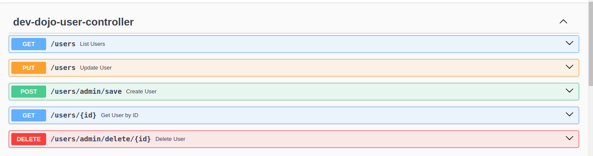
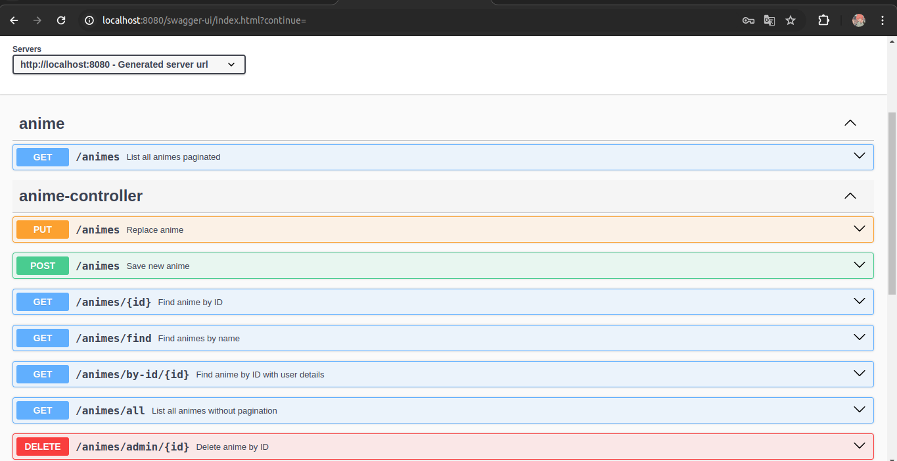
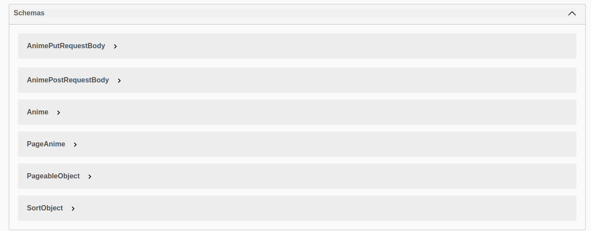
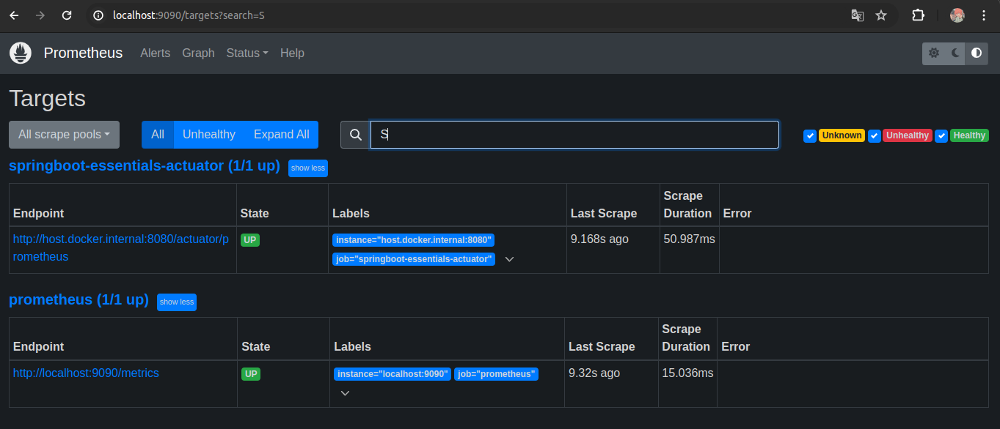
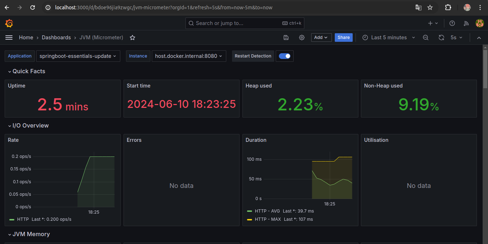
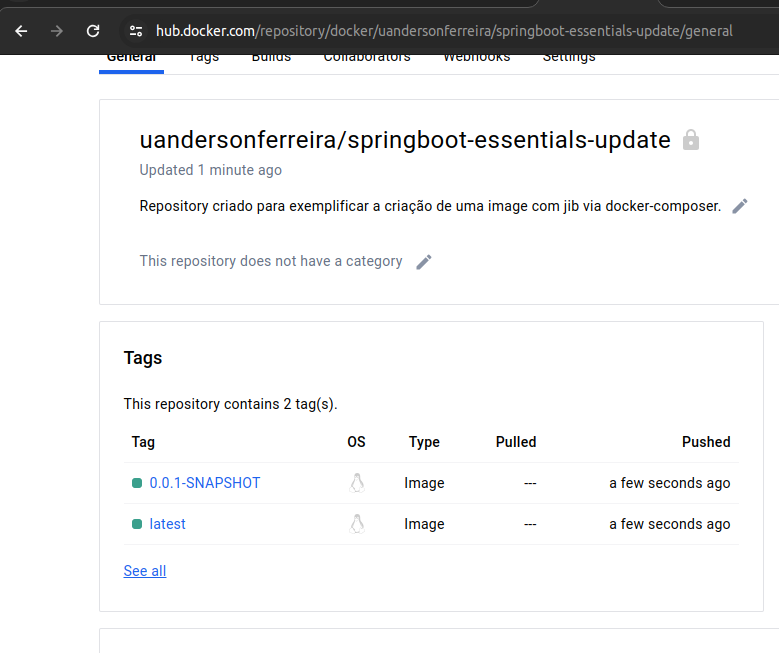
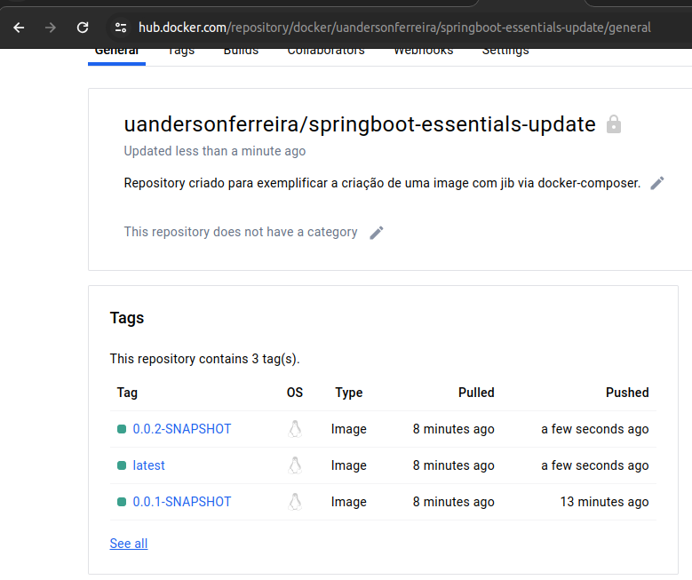

# <a href="https://spring.io/" target="_blank" rel="noreferrer">  </a> Spring Boot 2 - Essentials

> 🌱 Repositório dedicado aos estudos iniciais do ecossistema Spring e de seus tão
> famigerados frameworks que permeiam no mundo Java, por meio do canal do YouTube
> "DevDojo".

## Quem criou? 🧑
O cara com um parafuso a menos que colocou um curso desses gratuito foi este
aqui: [LinkedIn - William Suane](https://www.linkedin.com/in/williamsuane/)
<br/>

## Onde encontrar? 🔭

- [Clique aqui para acessar a playlist do curso](https://www.youtube.com/playlist?list=PL62G310vn6nFBIxp6ZwGnm8xMcGE3VA5H)
  <br/>

## Quais assuntos são abordados no curso?

1. Spring Boot 2 - Essentials 01 - O que é Spring Boot
1. Spring Boot 2 - Essentials 02 - Criando projeto na pedreiragem pt 01
1. Spring Boot 2 - Essentials 03 - Criando projeto na pedreiragem pt 02
1. Spring Boot 2 - Essentials 04 - @Component, @Autowired, @SpringBootApplication
1. Spring Boot 2 - Essentials 05 - Hot Swap com Spring Boot Devtools
1. Spring Boot 2 - Essentials 06 - Gerando projeto com start.spring.io
1. Spring Boot 2 - Essentials 07 - Método GET parte 1
1. Spring Boot 2 - Essentials 08 - Método GET parte 2
1. Spring Boot 2 - Essentials 09 - Método POST
1. Spring Boot 2 - Essentials 10 - Método DELETE
1. Spring Boot 2 - Essentials 11 - Método PUT
1. Spring Boot 2 - Essentials 12 - Instalando Docker e executando container MySQL
1. Spring Boot 2 - Essentials 13 - Spring Data JPA pt 01
1. Spring Boot 2 - Essentials 14 - Spring Data JPA pt 02
1. Spring Boot 2 - Essentials 15 - Framework de Mapeamento MapStruct
1. Spring Boot 2 - Essentials 16 - Request Params
1. Spring Boot 2 - Essentials 17 - Exceções Customizadas
1. Spring Boot 2 - Essentials 18 - Handler Global
1. Spring Boot 2 - Essentials 19 - Transações
1. Spring Boot 2 - Essentials 20 - Validações de campos
1. Spring Boot 2 - Essentials 21 - Handler para validação de Campos
1. Spring Boot 2 - Essentials 22 - Sobrescrevendo handler do Spring
1. Spring Boot 2 - Essentials 23 - Paginação
1. Spring Boot 2 - Essentials 24 - WebMvcConfigurer
1. Spring Boot 2 - Essentials 25 - Sorting, Log SQL
1. Spring Boot 2 - Essentials 26 - RestTemplate getForObject e getForEntity
1. Spring Boot 2 - Essentials 27 - RestTemplate exchange
1. Spring Boot 2 - Essentials 28 - RestTemplate POST
1. Spring Boot 2 - Essentials 29 - RestTemplate PUT e DELETE
1. Spring Boot 2 - Essentials 30 - Spring Data JPA Test pt 01
1. Spring Boot 2 - Essentials 31 - Spring Data JPA Test pt 02
1. Spring Boot 2 - Essentials 32 - Spring Data JPA Test pt 03
1. Spring Boot 2 - Essentials 33 - Unit Tests pt 01
1. Spring Boot 2 - Essentials 34 - Unit Tests pt 02
1. Spring Boot 2 - Essentials 35 - Unit Tests pt 03
1. Spring Boot 2 - Essentials 36 - Testes de Integração pt 01
1. Spring Boot 2 - Essentials 37 - Testes de Integração pt 02
1. Spring Boot 2 - Essentials 38 - Maven Profile Para Testes de Integração
1. Spring Boot 2 - Essentials 39 - Spring Security pt 01 - Autenticação em memória
1. Spring Boot 2 - Essentials 40 - Spring Security pt 01 - CSRF Token
1. Spring Boot 2 - Essentials 41 - Spring Security pt 02 - Segurança a nível de métodos com PreAuthorize
1. Spring Boot 2 - Essentials 42 - Spring Security pt 03 - Authentication Principal e página padrão
1. Spring Boot 2 - Essentials 43 - Spring Security pt 04 - Autenticação com usuário no banco de dados
1. Spring Boot 2 - Essentials 44 - Spring Security pt 05 - Proteção de URL com Antmatcher
1. Spring Boot 2 - Essentials 45 - Spring Security pt 06 - Testes de Integração com Spring Security
1. Spring Boot 2 - Essentials 46 - Documentação com SpringDoc OpenAPI pt 01
1. Spring Boot 2 - Essentials 47 - Documentação com SpringDoc OpenAPI pt 02
1. Spring Boot 2 - Essentials 48 - Spring Boot Actuator
1. Spring Boot 2 - Essentials 49 - Monitorando aplicação com Prometheus
1. Spring Boot 2 - Essentials 50 - Monitorando métricas com gráficos no Grafana
1. Spring Boot 2 - Essentials 51 - Criando imagem com Jib e executando via Docker Compose


## Tecnologias Utilizadas

|                         |                         |
|-------------------------|-------------------------|
| Java 17                 | PostgreSQL              |
| Spring Boot 3+          | H2                      |
| Spring Boot Web         | SpringDoc OpenAPI       |
| Spring Boot Data JPA    | MapStruct               |
| Spring Boot Validation  | Micrometer Registry Prometheus |
| Spring Boot Security 6+ | Lombok                  |
| Spring Boot Devtools    | Docker                  |
| Spring Boot Test        | Docker Compose          |
| Spring Boot Maven Plugin| Grafana                 |
|                         | Prometheus              |
|                         | Jib                     |

## Pré-requisitos

- Docker e Docker Compose instalados
- Maven instalado
- Conta no Docker Hub (para enviar imagens)

## Como Executar o Projeto
> **verifique os readmes do projeto para te auxiliar caso necessário**
> 
### 1. Clonar o Repositório

```sh
git clone https://github.com/uandersonferreira/springboot-essentials-devdojo-update.git
cd springboot-essentials-devdojo-update
```

### 2. Construir a Imagem Docker usando Jib (O mesmo para Atualizar no docker hub)

Utilize os seguintes comandos para construir e enviar a imagem Docker para o Docker Hub:

```sh
# Construir a imagem Docker localmente
sudo mvn jib:dockerBuild

# Enviar a imagem Docker para o Docker Hub
sudo mvn jib:build
```

### 3. Configurar o Docker Compose

Certifique-se de que o arquivo `docker-compose.yml` está configurado corretamente e contém todos os serviços necessários (banco de dados, Prometheus, Grafana e a aplicação Spring Boot).

### 4. Executar o Docker Compose

Execute os seguintes comandos para iniciar os serviços definidos no `docker-compose.yml`:

```sh
# Parar e remover todos os contêineres
docker-compose down

# Iniciar todos os contêineres
docker-compose up
```

### 5. Acessar os Serviços

- **Aplicação Spring Boot**: [http://localhost:8080/](http://localhost:8080/)
- **Prometheus**: [http://localhost:9090/](http://localhost:9090/)
- **Grafana**: [http://localhost:3000/](http://localhost:3000/)

## Endpoints Disponíveis

### AnimeController

> Demonstração dos endpoints criados para a realização de um CRUD
básico na aplicação.





### Monitorando a Aplicação com Prometheus

> Exemplificação do estabelecimento da conexão com o Prometheus.



### Monitorando Métricas com Gráficos no Grafana

> Exemplificação do monitoramento de algumas métricas durante a execução
> da aplicação provindas do Prometheus.



### Criando Imagem com Jib e Executando via Docker Compose

> Exemplificação da criação da imagem Docker usando Jib e execução via Docker Compose.



### Mandando uma Alteração da Imagem para o Docker Hub



## Links Úteis

- [Início Rápido com Jib](https://cloud.google.com/java/getting-started/jib?hl=pt-br)
- [Repositório Jib Maven Plugin no GitHub](https://github.com/GoogleContainerTools/jib/tree/master/jib-maven-plugin)
- [Imagens Distroless Disponíveis](https://console.cloud.google.com/gcr/images/distroless/GLOBAL)
- [Código do Projeto no GitHub](https://github.com/uandersonferreira/springboot-essentials-devdojo-update)

## Autor

- **Uanderson Ferreira** - [GitHub](https://github.com/uandersonferreira) | [LinkedIn](https://www.linkedin.com/in/uandersonferreira/)

---

