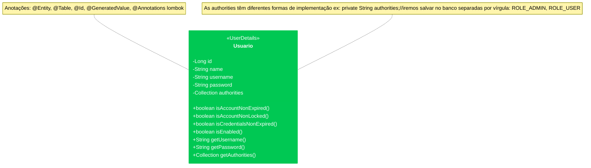

# Autenticação de Usuários no Banco de Dados e em memória com Spring Security 6.xx

## 1° Passo - Criar o UserDetails

Crie uma classe que represente o usuário que será usado no processo de autenticação do Spring Security. Essa classe deve implementar a interface `UserDetails`.

Neste diagrama, a classe `Usuario` implementa `UserDetails` (que já implementa `Serializable`), e os métodos sobrescritos da interface `UserDetails` retornam `true` por padrão.



Exemplo:

```java
@Data
@AllArgsConstructor
@NoArgsConstructor
@Builder
@Entity
public class DevDojoUserDetails implements UserDetails {
    @Id
    @GeneratedValue(strategy = GenerationType.IDENTITY)
    private Long id;
    @NotEmpty(message = "The user's name cannot be empty") 
    private String name;
    private String username;
    private String password;
    private String authorities; // Iremos salvar no banco separadas por vírgula: ROLE_ADMIN, ROLE_USER

    @Override
    public Collection<? extends GrantedAuthority> getAuthorities() {
        return Arrays.stream(authorities.split(","))
                     .map(SimpleGrantedAuthority::new)
                     .collect(Collectors.toList());
    }

    @Override
    public String getPassword() {
        return password;
    }

    @Override
    public String getUsername() {
        return username;
    }

    @Override
    public boolean isAccountNonExpired() {
        return UserDetails.super.isAccountNonExpired();
    }

    @Override
    public boolean isAccountNonLocked() {
        return UserDetails.super.isAccountNonLocked();
    }

    @Override
    public boolean isCredentialsNonExpired() {
        return UserDetails.super.isCredentialsNonExpired();
    }

    @Override
    public boolean isEnabled() {
        return UserDetails.super.isEnabled();
    }
}
```

## 2° Passo - Criar o Repository do UserDetails
### DevDojoUserDetailsRepository

#### Conceito:
O `DevDojoUserDetailsRepository` é uma interface que estende o `JpaRepository`, fornecendo métodos para realizar 
operações de persistência no banco de dados. Ele é parte da camada de acesso a dados da aplicação e é responsável
por realizar consultas e manipulações de dados para a entidade `DevDojoUserDetails`.

#### Função:
- **Operações CRUD:** Herda métodos padrão do `JpaRepository` para criar, ler, atualizar e deletar instâncias de `DevDojoUserDetails`.
- **Consulta por Nome de Usuário:** Define um método personalizado `findByUsername` para buscar um usuário 
 pelo nome de usuário, o que é essencial para o processo de autenticação.

#### Implementação:

```java
@Repository
public interface DevDojoUserDetailsRepository extends JpaRepository<DevDojoUserDetails, Long> {
    DevDojoUserDetails findByUsername(String username);
}
```

#### Explicação dos Componentes:

- **@Repository:** Anotação que indica que esta interface é um repositório do Spring, que trata da persistência 
 de dados. Permite que o Spring trate a interface como um bean e habilita a manipulação automática de exceções 
 relacionadas ao banco de dados.

- **JpaRepository<DevDojoUserDetails, Long>:** Interface do Spring Data JPA que fornece métodos padrão para realizar
 operações de persistência em uma entidade. O primeiro parâmetro (`DevDojoUserDetails`) especifica 
 o tipo da entidade e o segundo (`Long`) especifica o tipo do identificador(@Id) da entidade.

- **findByUsername(String username):** Método de consulta personalizado que permite buscar um usuário pelo
 nome de usuário. O Spring Data JPA gera automaticamente a implementação deste método com
 base na convenção de nomenclatura.

#### Função detalhada do método `findByUsername`:
- **Busca por Nome de Usuário:** Define uma consulta personalizada para encontrar um usuário com base no nome 
 de usuário. Quando chamado, este método consulta o banco de dados e retorna uma instância de `DevDojoUserDetails` 
 correspondente ao nome de usuário fornecido.

- **Utilização em Autenticação:** Este método é essencial para o processo de autenticação, pois permite
 que o `DevDojoUserDetailsService` obtenha os detalhes do usuário necessários para validar as credenciais
 do usuário durante o login.

Em resumo, o `DevDojoUserDetailsRepository` é um repositório Spring Data JPA que facilita a realização de 
operações de persistência para a entidade `DevDojoUserDetails`, incluindo uma consulta personalizada para
buscar usuários pelo nome de usuário. Ele é crucial para a camada de acesso a dados na aplicação e suporta 
o serviço de autenticação `DevDojoUserDetailsService`.

## 3° Passo - Criar o Serviço do UserDetails

#### Conceito:
O `DevDojoUserDetailsService` é uma implementação da interface `UserDetailsService` do Spring Security.
Ele é responsável por carregar os dados do usuário a partir de uma fonte de dados específica, que, 
neste caso, é um banco de dados. A interface `UserDetailsService` define um único método, 
`loadUserByUsername(String username)`, que deve ser implementado para localizar e retornar 
os detalhes do usuário com base no nome de usuário fornecido.

#### Função:
- **Carregamento de Usuários:** A principal função do `DevDojoUserDetailsService` é carregar os detalhes 
 do usuário a partir do banco de dados quando solicitado pelo Spring Security durante o processo de autenticação.

- **Integração com o Repositório:** Ele utiliza um repositório (neste caso, `DevDojoUserDetailsRepository`) para
  realizar consultas no banco de dados e obter os detalhes do usuário.

- **Conversão de Dados:** Converte a entidade de usuário retornada pelo repositório em um objeto que implementa 
  a interface `UserDetails`, que é necessária pelo Spring Security para autenticação e autorização.

#### Implementação:

```java
@Service
@RequiredArgsConstructor
public class DevDojoUserDetailsService implements UserDetailsService {
    private final DevDojoUserDetailsRepository devDojoUserDetailsRepository;

    @Override
    public UserDetails loadUserByUsername(String username) throws UsernameNotFoundException {
        return Optional.ofNullable(devDojoUserDetailsRepository.findByUsername(username))
                .orElseThrow(() -> new UsernameNotFoundException("DevDojo user not found"));
    }
}
```

#### Explicação dos Componentes:

- **@Service:** Anotação que marca esta classe como um serviço do Spring, tornando-a um componente detectável pelo 
 Spring durante a varredura de componentes.

- **@RequiredArgsConstructor:** Anotação do Lombok que gera um construtor com argumentos para os campos finais (final),
  facilitando a injeção de dependências.

- **DevDojoUserDetailsRepository:** Repositório JPA utilizado para interagir com o banco de dados e recuperar os 
 detalhes do usuário com base no nome de usuário.

- **loadUserByUsername(String username):** Método sobrescrito da interface `UserDetailsService`. Ele tenta encontrar
 um usuário pelo nome de usuário usando o repositório. Se não encontrar, lança uma `UsernameNotFoundException`.

**Função detalhada do método `loadUserByUsername`:**
- **Busca no Repositório:** Utiliza o repositório `DevDojoUserDetailsRepository` para buscar um usuário pelo nome de usuário.
- **Tratamento de Usuário Não Encontrado:** Caso o repositório não retorne um usuário, lança uma exceção
 `UsernameNotFoundException` com uma mensagem apropriada.
- **Retorno do Usuário:** Se o usuário for encontrado, retorna o objeto `DevDojoUserDetails`, que implementa 
 `UserDetails`, contendo as informações do usuário necessárias para o Spring Security.

Em resumo, o `DevDojoUserDetailsService` é a ponte entre o banco de dados e o Spring Security, fornecendo os detalhes 
do usuário necessários para autenticação e autorização a partir de uma fonte de dados persistente.


## 4° Passo - Criar a Classe de Configuração de Segurança

Na configuração de segurança do Spring Security, a classe `SecurityConfig` contém métodos
`@Bean` principais que definem como a segurança será configurada e gerenciada na aplicação.
Aqui estão os conceitos de cada um:

### SecurityFilterChain

**Conceito:**
O `SecurityFilterChain` é um componente essencial no Spring Security que define a configuração 
de segurança da aplicação web. Ele especifica quais URLs devem ser protegidas, quais tipos de
autenticação e autorização devem ser aplicadas, e como o login e logout devem ser tratados.

**Função:**
- Configura as regras de autorização para diferentes endpoints.
- Define a forma de autenticação (como autenticação básica HTTP ou login baseado em formulário).
- Permite desativar certas proteções, como CSRF, para cenários específicos.

### AuthenticationManager

**Conceito:**
O `AuthenticationManager` é responsável por gerenciar o processo de autenticação dos usuários.
Ele coordena diferentes provedores de autenticação (como provedores em memória e no banco de dados)
para verificar as credenciais do usuário.

**Função:**
- Verifica as credenciais do usuário (username e password).
- Integra múltiplos `AuthenticationProvider` para suportar diferentes fontes de dados 
  de usuários (por exemplo, em memória e banco de dados).
- Retorna um objeto `Authentication` que indica se a autenticação foi bem-sucedida.

### PasswordEncoder

**Conceito:**
O `PasswordEncoder` é uma interface do Spring Security usada para codificar (hashing) senhas.
Isso garante que as senhas não sejam armazenadas como texto simples, aumentando a segurança.

**Função:**
- Codifica as senhas antes de armazená-las.
- Compara senhas codificadas durante o processo de autenticação.
- Suporta diferentes algoritmos de codificação, como BCrypt.

### UserDetailsService (inMemory) | DevDojoUserDetailsService (Database)

**Conceito:**
O `UserDetailsService` é uma interface que carrega dados específicos do usuário. No contexto 
de diferentes implementações, ele pode carregar usuários de diferentes fontes,
como memória ou banco de dados.

**Função:**
- `inMemoryUserDetailsService`: Fornece uma implementação de `UserDetailsService` que carrega 
   os detalhes do usuário a partir de uma lista em memória.
- `DevDojoUserDetailsService`: Fornece uma implementação de `UserDetailsService` que carrega 
   os detalhes do usuário a partir de um banco de dados, utilizando um repositório JPA.

**Diferença entre Implementações:**
- **InMemoryUserDetailsService:** Usado para cenários simples ou de teste onde os usuários e suas
  credenciais são armazenados em memória.
- **DevDojoUserDetailsService:** Usado para aplicações reais onde os usuários e suas credenciais 
   são armazenados em um banco de dados relacional, proporcionando maior escalabilidade e persistência.

### Implementação na Classe de Configuração

A classe `SecurityConfig` integra todos esses componentes para configurar a segurança da aplicação:

- **SecurityFilterChain:** Configura as regras de segurança para diferentes endpoints e métodos HTTP.
- **AuthenticationManager:** Gerencia a autenticação usando múltiplos `AuthenticationProvider`.
- **PasswordEncoder:** Define como as senhas são codificadas e comparadas.
- **UserDetailsService:** Carrega os detalhes do usuário de memória ou banco de dados para autenticação.

Essa configuração permite que a aplicação autentique e autorize usuários de forma segura, utilizando práticas 
recomendadas de segurança, como o hashing de senhas e a segregação de responsabilidades entre diferentes
componentes de segurança.

```java
@EnableWebSecurity 
@Configuration 
@EnableSpringDataWebSupport(pageSerializationMode = EnableSpringDataWebSupport.PageSerializationMode.VIA_DTO)
@Log4j2
@EnableMethodSecurity 
@RequiredArgsConstructor
public class SecurityConfig {

    private final DevDojoUserDetailsService devDojoUserDetailsService;
    
    @Bean 
    public SecurityFilterChain securityFilterChain(HttpSecurity http) throws Exception {
        http.csrf(AbstractHttpConfigurer::disable); // Desabilitando o CSRF (cenário de estudo)
        http.authorizeHttpRequests(authorize -> authorize
                .requestMatchers("/animes/admin/**").hasRole("ADMIN") 
                .requestMatchers("/animes/**").hasRole("USER")
                .anyRequest().authenticated())
            .httpBasic(Customizer.withDefaults())
            .formLogin(Customizer.withDefaults())
            .logout(Customizer.withDefaults());

        return http.build();
    }

    @Bean // Define um bean Spring
    public AuthenticationManager authenticationManager(PasswordEncoder passwordEncoder) { 
        DaoAuthenticationProvider inMemoryProvider = new DaoAuthenticationProvider(); 
        inMemoryProvider.setUserDetailsService(inMemoryUserDetailsService());
        inMemoryProvider.setPasswordEncoder(passwordEncoder); 

        DaoAuthenticationProvider databaseProvider = new DaoAuthenticationProvider(); 
        databaseProvider.setUserDetailsService(devDojoUserDetailsService); 
        databaseProvider.setPasswordEncoder(passwordEncoder); 

        ProviderManager providerManager = new ProviderManager(inMemoryProvider, databaseProvider); 
        providerManager.setEraseCredentialsAfterAuthentication(false); 

        return providerManager;
    }

    @Bean
    public UserDetailsService inMemoryUserDetailsService() {
        UserDetails adminInMemory = User
                .withUsername("admin_memory")
                .password(passwordEncoder().encode("123"))
                .roles("USER", "ADMIN")
                .build();

        UserDetails userInMemory = User
                .withUsername("user_memory")
                .password(passwordEncoder().encode("123"))
                .roles("USER")
                .build();
        
        return new InMemoryUserDetailsManager(adminInMemory, userInMemory);
    }

    @Bean
    public PasswordEncoder passwordEncoder() {
        return PasswordEncoderFactories.createDelegatingPasswordEncoder();
    }
}
```

Essa documentação deve fornecer uma visão clara e detalhada dos passos necessários para configurar 
a autenticação usando Spring Security com usuários em memória e no banco de dados. Certifique-se 
de ajustar as anotações e mensagens conforme necessário para o seu caso específico.