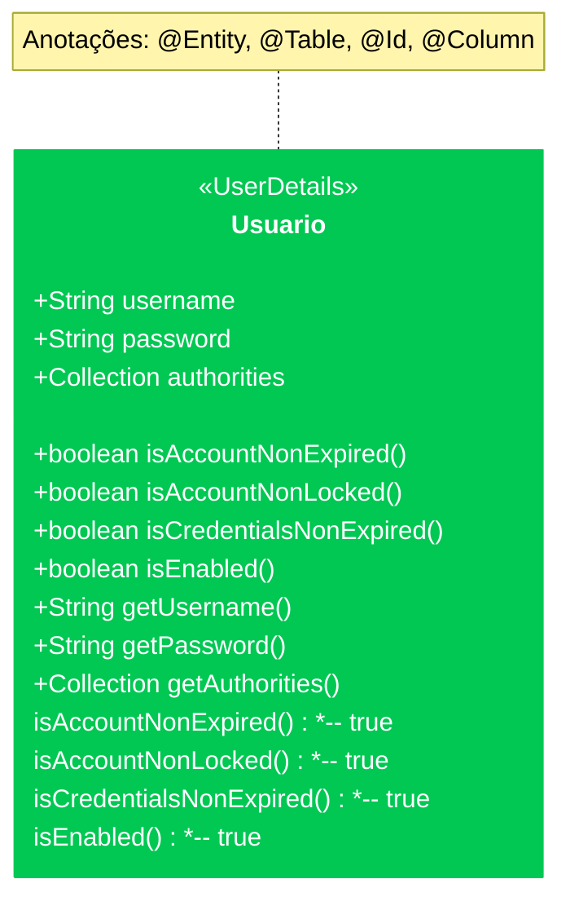

# Autenticação de Usuários no banco de dados com Spring Security 6.xx

## 1° Passo - Criar o UserDetails

Criar uma classe que irá representar o Usuário que será usado no processo de autenticação do spring security, para isso segue a representa do diagrama.

Neste diagrama, a classe Usuario implementa UserDetails( já implementa o Serializable ), e os métodos sobrescritos da interface UserDetails retornam true.

## 2° - Passo - Criar o Repository do UserDetails

Devemos criar o repository do userDetails com o método
`findByName(String username)`

