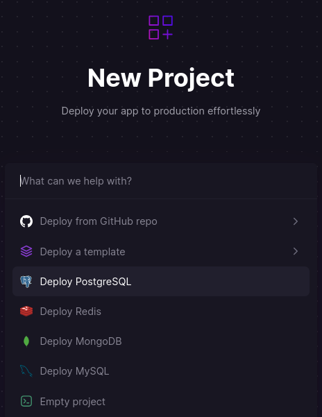
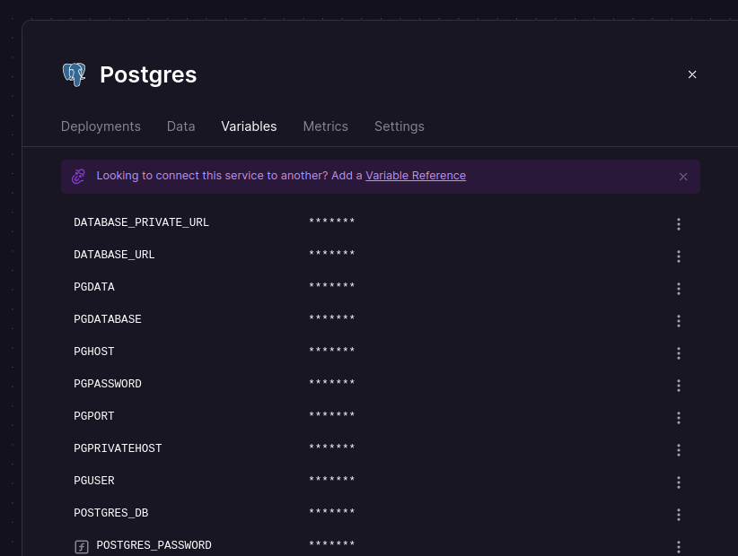
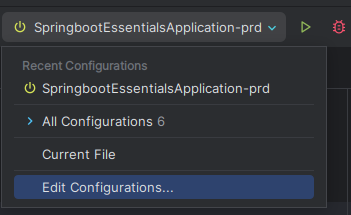
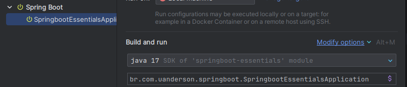
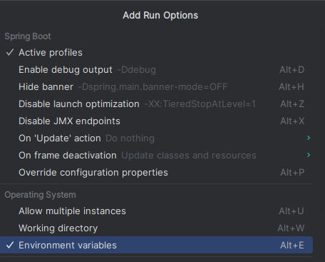
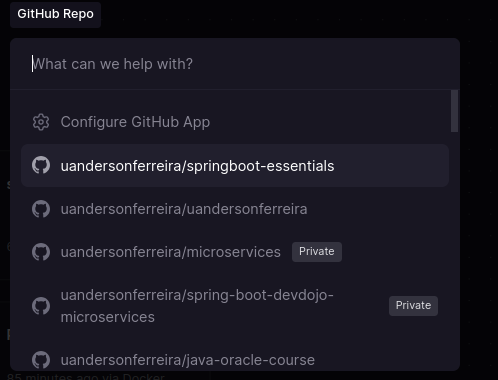
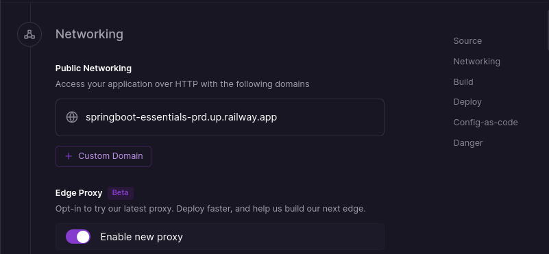
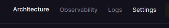
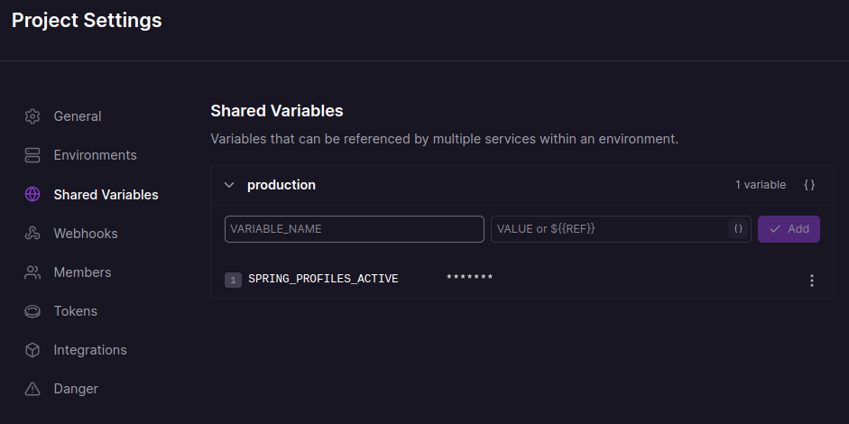
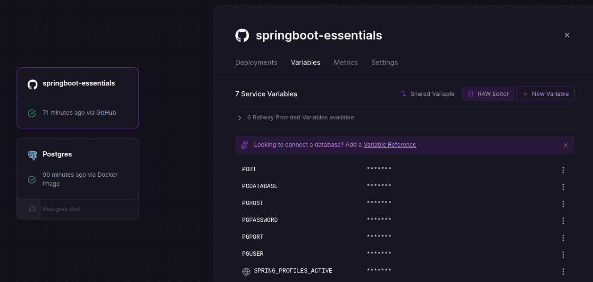

## Passo a passo das configurações para Deploy

1. **Criar sua conta do site do railway e criar um service do postgresql**
apos criar a base de dados pegue as seguintes variáveis do banco em nuvem, 
para configurar no seu projeto:

```
PGDATABASE=nome_do_banco_de_dados;
PGHOST=seu_host_aqui;
PGPASSWORD=sua_senha_aqui;
PGPORT=sua_porta_aqui;
PGUSER=seu_usuario_aqui;
```





2. **Crie um arquivo `application-prd.yml`** no diretório de configurações do 
seu projeto. Este arquivo conterá as configurações específicas do seu ambiente 
de produção. (crimaos outro application para deixar separado as coisas)

3. **Configure o banco de dados e as variáveis de ambiente** no arquivo
`application-prd.yml`. Você pode usar placeholders para as variáveis de 
ambiente, que serão substituídas pelos valores reais durante o tempo de 
execução. Aqui vai as configs do database em nuvem que pegou no inicio.
Por exemplo:

```yaml
spring:
  datasource:
    url: jdbc:postgresql://${PGHOST}:${PGPORT}/${PGDATABASE}
    username: ${PGUSER}
    password: ${PGPASSWORD}
  jpa:
    hibernate:
      ddl-auto: update
  profiles:
    active: ${SPRING_PROFILES_ACTIVE}
```
> **Observation:** se tentar subir com o `validate` de primeira vai dar erro.


### Se estiver utilizando o Intellij IDEA faça o seguinte para configurar as variaveis de ambiente.
> Edit configuration(Run/Debug configuration) > 'modify options' e ative duas configurações
- Environment variables
- Active profiles





- Agora basta adicionar as variaveis de ambiente a IDE 
```
PGDATABASE=nome_do_banco_de_dados
PGHOST=seu_host_aqui
PGPASSWORD=sua_senha_aqui
PGPORT=sua_porta_aqui
PGUSER=seu_usuario_aqui

SPRING_PROFILES_ACTIVE=prd
```
> **Faça o teste para ver ser a aplicação está subindo com o profile "prd" e tente conectar com o database em nuvem**

4. **Correção de CORS ao tentar executar a api no Swagger**
- Para corrigir problemas de CORS relacionados ao Swagger, você pode adicionar a anotação @OpenAPIDefinition com um servidor padrão na sua classe principal. Isso ajudará a definir a URL base para o Swagger UI e evitar problemas de CORS quando o frontend tentar acessar a documentação da API.

Aqui está como sua classe principal pode ficar com a anotação adicionada:
```java
import org.springframework.boot.SpringApplication;
import org.springframework.boot.autoconfigure.SpringBootApplication;
import io.swagger.v3.oas.annotations.OpenAPIDefinition;
import io.swagger.v3.oas.annotations.servers.Server;

@OpenAPIDefinition(servers = { @Server(url = "/", description = "Default Server URL") })
@SpringBootApplication
public class Application {
    public static void main(String[] args) {
        SpringApplication.run(Application.class, args);
    }
}

```


5.  #### Agora é criar o service do projeto no railway que deve estar no github com essas configurações.


- Irá tentar fazer o deploy automáticamente, mas vai dar erro pois não está configurado 
corretamente.


6. Acesse a aba  `Settings` e vá até  `Networking` e desabilite essa opção
pois queremos gerar uma url para outras pessoas acessar a aplicação. vai gerar algo 
parecido




7. Agora iremos configurar o Profile `prd` para ficar de acordo com as configs do `application-prd.yml`
- Acesse `settings` para configurações gerais do ambiente em produção



- Vá até shared variables é configura o profile



8. Agora vamos configurar as variaveis de ambinete da nossa aplicação
 - selecione a aplicação e vai em variables e Raw Editor e adiciona as seguintes config:
 - Adicione a shared variables do profile também 
```
PORT=8080
PGDATABASE=nome_do_banco_de_dados
PGHOST=seu_host_aqui
PGPASSWORD=sua_senha_aqui
PGPORT=sua_porta_aqui
PGUSER=seu_usuario_aqui

SPRING_PROFILES_ACTIVE=${{shared.SPRING_PROFILES_ACTIVE}}
```



Agora tu pode aplicar as mudanças e realizar o deploy da aplicação (Normalmente é automatico)
