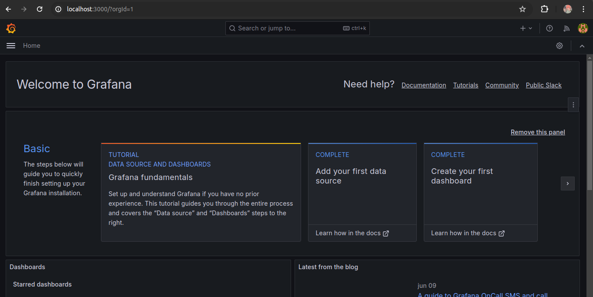

# Configuração das Métricas do Prometheus no Grafana

> **Observação:** Sempre lembrar de executar `docker-compose down` e `docker-compose up` (ou adicionar `sudo` se necessário) para aplicar as configurações.

## Passo 1: Configuração do Grafana no `docker-compose.yml`

Adicione a configuração do serviço Grafana no seu arquivo `docker-compose.yml`:

```yaml
grafana:
  image: grafana/grafana:latest
  container_name: grafana
  restart: unless-stopped
  ports:
    - '3000:3000'
```

## Passo 2: Acessar o Grafana

Abra o navegador e acesse o Grafana usando o seguinte URL:

```
http://localhost:3000/
```



## Passo 3: Configurar a Fonte de Dados do Prometheus no Grafana

Para configurar a fonte de dados do Prometheus no Grafana, siga os passos abaixo:

1. **Definir o Nome da Fonte de Dados**:
    - No menu lateral esquerdo, clique em "Configuration" (Configuração) e depois em "Data Sources" (Fontes de Dados).
    - Clique em "Add data source" (Adicionar fonte de dados).
    - Escolha "Prometheus" na lista de opções.

2. **Informar a URL do Prometheus**:
    - No campo "Name" (Nome), digite um nome descritivo, por exemplo, `Prometheus`.
    - No campo "URL", digite `http://prometheus:9090`.


## Passo 4: Importar o Dashboard para Visualizar as Métricas

Para importar um dashboard que facilita a visualização das métricas:

1. Acesse o link: [Dashboard JVM Micrometer](https://grafana.com/grafana/dashboards/4701-jvm-micrometer/)
    - Este link contém um dashboard pré-configurado para visualização de métricas JVM usando Micrometer.

2. Importe o Dashboard no Grafana:
    - No menu lateral, clique em "Dashboards" e depois em "Manage".
    - Clique em "Import" e insira o ID do dashboard (por exemplo, 4701) ou o URL.
    - Configure o dashboard importado conforme necessário.

### Configuração do Spring Boot para Expor Métricas

Certifique-se de que a sua aplicação Spring Boot está configurada para expor métricas via Actuator. Adicione a seguinte configuração na sua classe principal:

```java
@SpringBootApplication
public class SpringbootEssentialsApplication {

    public static void main(String[] args) {
        SpringApplication.run(SpringbootEssentialsApplication.class, args);
    }

    @Bean
    MeterRegistryCustomizer<MeterRegistry> configurer(
            @Value("${spring.application.name}") String applicationName) {
        return (registry) -> registry.config().commonTags("application", applicationName);
    }
}
```

Essa configuração adiciona um `commonTag` com o nome da aplicação a todas as métricas, facilitando a identificação no Grafana.


Com esses passos, você terá o Grafana configurado para visualizar as métricas da sua aplicação Spring Boot monitoradas pelo Prometheus.

## Referências

- [Documentação do Grafana](https://grafana.com/docs/grafana/latest/)
- [Documentação do Prometheus](https://prometheus.io/docs/introduction/overview/)
- [Documentação do Spring Boot Actuator](https://docs.spring.io/spring-boot/docs/current/reference/html/actuator.html)

---
